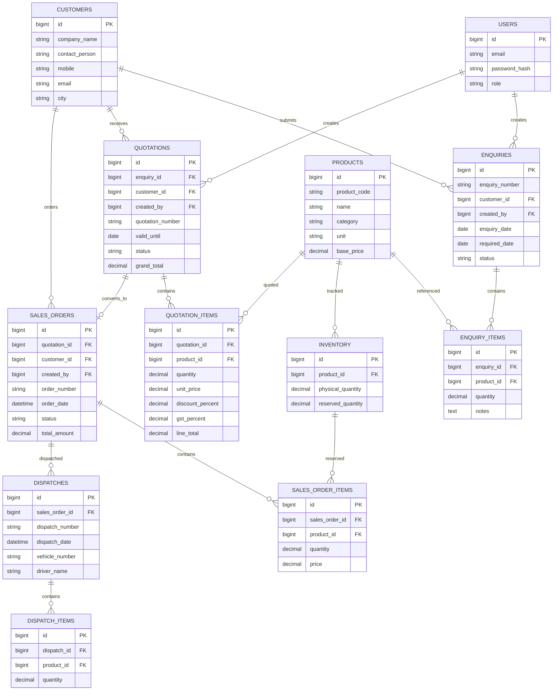

# ER Diagram

```mermaid
erDiagram
  USERS ||--o{ ENQUIRIES : creates
  USERS ||--o{ QUOTATIONS : creates
  CUSTOMERS ||--o{ ENQUIRIES : submits
  CUSTOMERS ||--o{ QUOTATIONS : receives
  CUSTOMERS ||--o{ SALES_ORDERS : orders
  ENQUIRIES ||--o{ ENQUIRY_ITEMS : contains
  PRODUCTS ||--o{ ENQUIRY_ITEMS : referenced
  PRODUCTS ||--o{ INVENTORY : tracked
  PRODUCTS ||--o{ QUOTATION_ITEMS : quoted
  QUOTATIONS ||--o{ QUOTATION_ITEMS : contains
  QUOTATIONS ||--o| SALES_ORDERS : converts_to
  SALES_ORDERS ||--o{ SALES_ORDER_ITEMS : contains
  SALES_ORDERS ||--o{ DISPATCHES : dispatched
  DISPATCHES ||--o{ DISPATCH_ITEMS : contains
  INVENTORY ||--o{ SALES_ORDER_ITEMS : reserved

  USERS {
    bigint id PK
    string email
    string password_hash
    string role
  }

  CUSTOMERS {
    bigint id PK
    string company_name
    string contact_person
    string mobile
    string email
    string city
  }

  ENQUIRIES {
    bigint id PK
    string enquiry_number
    bigint customer_id FK
    bigint created_by FK
    date enquiry_date
    date required_date
    string status
  }

  ENQUIRY_ITEMS {
    bigint id PK
    bigint enquiry_id FK
    bigint product_id FK
    decimal quantity
    text notes
  }

  PRODUCTS {
    bigint id PK
    string product_code
    string name
    string category
    string unit
    decimal base_price
  }

  INVENTORY {
    bigint id PK
    bigint product_id FK
    decimal physical_quantity
    decimal reserved_quantity
  }

  QUOTATIONS {
    bigint id PK
    bigint enquiry_id FK
    bigint customer_id FK
    bigint created_by FK
    string quotation_number
    date valid_until
    string status
    decimal grand_total
  }

  QUOTATION_ITEMS {
    bigint id PK
    bigint quotation_id FK
    bigint product_id FK
    decimal quantity
    decimal unit_price
    decimal discount_percent
    decimal gst_percent
    decimal line_total
  }

  SALES_ORDERS {
    bigint id PK
    bigint quotation_id FK
    bigint customer_id FK
    bigint created_by FK
    string order_number
    datetime order_date
    string status
    decimal total_amount
  }

  SALES_ORDER_ITEMS {
    bigint id PK
    bigint sales_order_id FK
    bigint product_id FK
    decimal quantity
    decimal price
  }

  DISPATCHES {
    bigint id PK
    bigint sales_order_id FK
    string dispatch_number
    datetime dispatch_date
    string vehicle_number
    string driver_name
  }

  DISPATCH_ITEMS {
    bigint id PK
    bigint dispatch_id FK
    bigint product_id FK
    decimal quantity
  }
```
